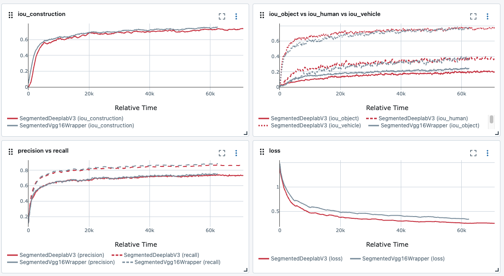

# Future vision transport
[](https://github.com/Wonters/future_vision_transport)
## Table of content
- [Description](#description)
- [Installation](#installation)
- [Train](https://www.futurevisiontransport.com/)


## Description
Future vision transport handle to generetate segmented images of 
driving area to give the process of mask generation automatic.
Image segmented generation for autonomous drive is a major challenge because 
of the complexity of masks, the precision required, and the cost of computing.  
This application handle the long task of a manual segmentation if new images.

This project is a proof of concept for a future vision transport base on Cityscape dataset.
It works with different models for segmentation as DeepLabV3, VGG16, Unet and DilatedNet.

It regroupe categories in seven main classes from the dataset, containing 30 classes. 

After several iterations, VGG16 seems to perform the best.

## Architecture
- app.py -> gradio interface
- api.py -> fastapi interface
- config.py -> configuration
- dataset.py -> dataset
- deeplearning.py -> CNN architectures
- train.py -> training
- wrapper.py -> wrapper for CNN models
- utils.py -> mask operations
- analyse.ipynb -> notebook for analysis

## Installation

The environement file is .env. To work with a specified wrapper, change the value of WRAPPER_NAME in the .env file. 

```bash
docker compose up --build
```

## Metrics 
Mlflow is used for metrics. It records time, loss, macro recall and precion, micro IoU.

Exemple of metrics on mlflow:


## Train on GPU
DEBUG
```bash
export TORCH_DISTRIBUTED_DEBUG=DETAIL
```
For a training on MultiGPU instances 
```bash
python -m torch.distributed.run --nproc_per_node=2 train.py
```
